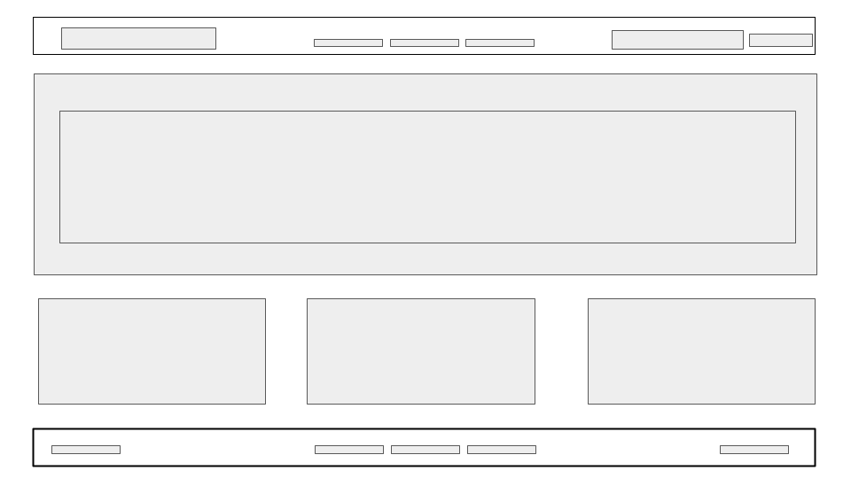

## USER STORY
As a person new to town, I want to be able to find local Breweries to fit my needs, or be able to find entertaintment for fun, so that I am able to discover new places and meet new people!

## DESCRIPTION
We want to create a user-friendly application that will allow users moving to a new area, or looking for more to do in their area, find bars and other forms of entertainment in their geographical areas. Our goal is to help people find fun and safe ways to engage with others in their community.

## ABOUT THE PROJECT

## FINAL PRODUCT

[Deployed Website]()

## BUILT WITH
* ZURB Foundation
* Server-side APIs
* Git branching workflow
* Agile software development

## USUAGE

## ROADMAP
See the issues (GitHub) for a list of proposed changes.

## AUTHORS
* Matias A. ~ matiasahrensdorf@gmail.com
* Celeste F. ~ celestefarris@hotmail.com
* Pamela C. ~ pamelac021@gmail.com
* Shikelia H. ~ Hagensshik@gmail.com

## ACKNOWLEGEMENTS
* Open Brewery DB
* Ticket Master

